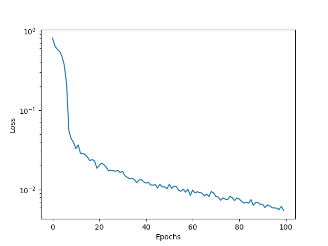

# Marabou

## Explore the Marabou Resources Directory

Marabou Resources 의 [README](https://github.com/NeuralNetworkVerification/Marabou/blob/master/resources/README.md) 를 살펴보면, 이 디렉터리는 tool 논문에서의 Marabou 실험 결과에 대한 재현을 위한 파일들이라고 한다.

한번 하나씩 살펴보도록 하겠다.

### 1. [bnn_queries](https://github.com/NeuralNetworkVerification/Marabou/tree/master/resources/bnn_queries)

bnn_queries는 아마 베이지안 신경망의 검증을 위한 query 로 보인다.
smallBNN_parsed 는  smallBNN_original 의 일부를 떼온 것으로 보인다.

### 2. [img](https://github.com/NeuralNetworkVerification/Marabou/tree/master/resources/img)

img 에는  파일하나가 존재한다.
이 그림은 시간에 흐름에 따라, 문제를 분할하면서 Sat 인지 Unsat 인지 판별하는 모습을 도식하고 있다.

### 3. [keras](https://github.com/NeuralNetworkVerification/Marabou/tree/master/resources/keras)

keras 디렉터리에는 keras 모델 파일이 있다. 이름으로 추측컨데, mnist 에 대하여 학습된 작은 모델들인 것으로 보인다.

### 3. [mps](https://github.com/NeuralNetworkVerification/Marabou/tree/master/resources/mps)

mps 디렉터리에는 lp solver 를 구동하기 위한 MPS 포맷으로 작성된 파일들이 있다.

### 4. [nnet](https://github.com/NeuralNetworkVerification/Marabou/tree/master/resources/nnet)

nnet 에는 [NNet](https://github.com/sisl/NNet) Format 으로 인코딩된 네트워크들이 저장되어 있다.

[README](https://github.com/NeuralNetworkVerification/Marabou/blob/master/resources/README.md) 에 따르면, nnet folder 의 각 폴더는 각 벤치마크 카테고리 연결된다.

* [acasxu](https://github.com/NeuralNetworkVerification/Marabou/tree/master/resources/nnet/acasxu): Reluplex 논문의 ACAS XU benchmarks.
* [coav](https://github.com/NeuralNetworkVerification/Marabou/tree/master/resources/nnet/coav): Planet 논문의 CollisionAvoidance benchmarks.
* [twin](https://github.com/NeuralNetworkVerification/Marabou/tree/master/resources/nnet/twin): Planet 저장소의 TwinStreams benchmarks.

그외에 [mnist](https://github.com/NeuralNetworkVerification/Marabou/tree/master/resources/nnet/mnist) 는 MNIST dataset 에 대해 학습된 Network 를 저장하고 있다.

### 5. [onnx](https://github.com/NeuralNetworkVerification/Marabou/tree/master/resources/onnx)

onnx 는 여러 모델을 onnx 형식으로 저장하고 있다.

### 6. [properties](https://github.com/NeuralNetworkVerification/Marabou/tree/master/resources/properties)

[README](https://github.com/NeuralNetworkVerification/Marabou/blob/master/resources/README.md) 에 따르면, Properties 는 
acas_property_[1-4].txt 로 이름이 붙여진 4 개 properties 는 ACAS XU networks 에 관련있다.
그리고 builtin_property.txt 는 CollisionAvoidance and TwinStreams benchmarks 를 위한 것이다.

### 7. [target](https://github.com/NeuralNetworkVerification/Marabou/tree/master/resources/target)

[README.md](https://github.com/NeuralNetworkVerification/Marabou/blob/master/resources/target/README.md) 에 따르면, 이 폴더는 challenging 한 쿼리들을 모아놓은 디렉터리이다.

## Run Marabou with an External Model and Dataset

### 1. 학습과 저장

x 는 [0, 1], y 는 [0, 40] z 는 [20, 40] 구간의 값이고, 2x + y / z 를 타겟으로 갖는 데이터셋을 상정했고, 이 데이터에 대해 3개의 linear 와 2개 의 sigmoid 로 구성된 뉴럴 네트워크를 학습했다.
입력값과 출력값의 범위가 명확하고 작은 뉴런 네트워크 이기 때문에 Marabou 사용을 통한 검증에 적합하다고 생각했다.

RMSE 를 사용했고, 100 epoch 학습에서 최종 학습로스 5.502e-03 를 얻었다.

Marabou 활용을 위해 onnx 형식으로 저장하였다.

detail 은 [reliable/3/make_my_model.py](https://github.com/abzb1/reliable/blob/main/3/make_my_model.py) 에서 확인할 수 있다.

### 2. Marabou 사용한 모델 검증

Marabou 저장소의 [예시 코드](https://github.com/NeuralNetworkVerification/Marabou/blob/master/maraboupy/examples/1_ONNXExample.py) 을 활용하여 학습한 신경망을 검증해 보았다.

학습한 구간에서 LowerBound 를 4.0+(1e-5), UpperBound 를 -(1e-5) 로 설정했을 때, unsat 의 결과를 얻을 수 있었다.
즉, 모델은 적어도 학습된 구간에서 안전함을 보였다.

다음으로 x변수에 대한 안전성을 검토해보았다.
x 에 대해 값의 범위를 [0, 20,000] 까지 늘렸을 때, output 의 LowerBound 가 여전히 40000+2.0+(1e-5) 에서 unsat 됨을 확인했다.
x 값의 범위를 [-20,000, 0] 까지 늘렸을 때도, output 의 UpperBound 가 -40000-(1e-5) 에서 unsat 됨을 확인했다.

detail 은 [reliable/3/validation_with_marabou.py](https://github.com/abzb1/reliable/blob/main/3/validation_with_marabou.py) 에서 확인할 수 있다.
